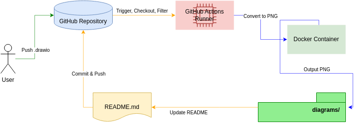

# drawio-readme-updater
Automatic generating/updating of PNG images from .drawio diagrams and their integration into README.md.

**Docker image used for conversion:** [rlespinasse/drawio-export](https://github.com/rlespinasse/drawio-export)  

## How to use?
1. Copy the `.github` folder to your repository  
2. Update any `.drawio` file and push changes
3. Check the **Actions** tab of your project and make sure the yml file worked successfully
---
Why does it exist?
- Diagrams are convenient.
- I can edit the xml (for example via [this](https://marketplace.cursorapi.com/items?itemName=hediet.vscode-drawio)).
- Gemini is great at creating them and editing them (though it has huge design problems).
- It turned out to be much more convenient than drawing everything on paper (more convenient, not faster, not slower).
---
*Have fun*
